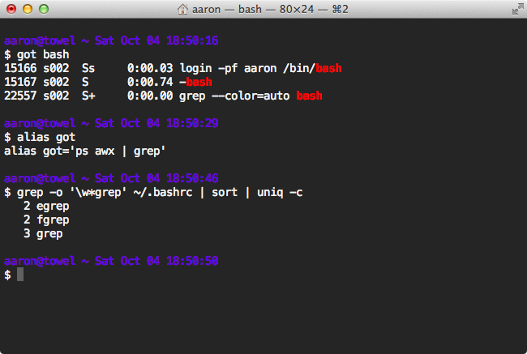
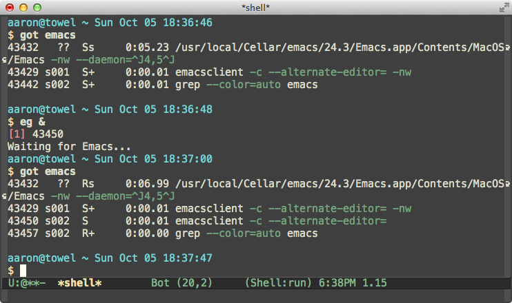
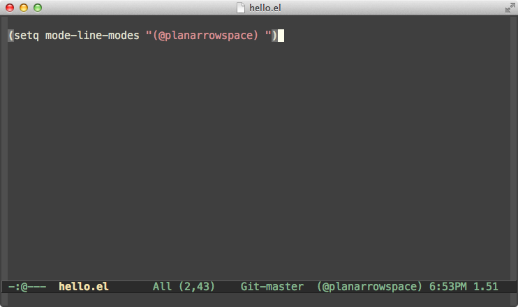
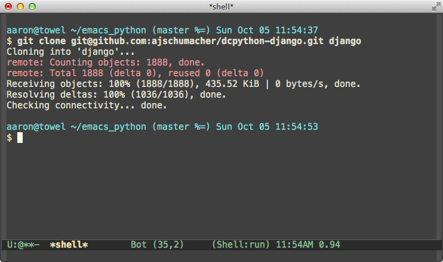

# Emacs and Python

A short talk at the [DC Python meetup group][] on [October 7, 2014][],
introducing [Emacs][] through demonstration of fun and useful
features. Thanks to [Eddie Welker] for hosting the event and putting
up [video]!

[DC Python meetup group]: http://www.meetup.com/DCPython/
[October 7, 2014]: http://www.meetup.com/DCPython/events/208969552/
[Emacs]: http://www.gnu.org/software/emacs/
[Eddie Welker]: https://twitter.com/edwelker
[video]: https://www.youtube.com/watch?v=eH-epEqLVAs

This is a screen you see when you start up Emacs. There's a tutorial
and a manual and it's all very user-friendly.

    M-x tetris

Tetris is included in base Emacs. But Emacs is also a text editor.
Editing text is important.

So why Emacs?

    C-x C-c

In addition to editing text, you probably need or want to send
computers commands via text. It may be convenient or necessary to be
productive in a pure text environment. So it is a desirable
characteristic of a text editor that it be as capable in text mode as
graphical mode. There are two serious contenders: [Vim][] and Emacs.

[Vim]: http://www.vim.org/

There are further reasons to prefer a keyboard-based interface, but at
a minimum we need an editor that can be used over [ssh][].

[ssh]: http://en.wikipedia.org/wiki/Secure_Shell

    got bash
    alias got
    grep -o '\w*grep' ~/.bashrc | sort | uniq -c

I use [bash][], and I have it customized a little bit, which makes it
nicer.

[bash]: http://www.gnu.org/software/bash/

If you're competent in a shell like `bash`, you know some keyboard
shortcuts. Defaults like <kbd>Ctrl</kbd> + <kbd>a</kbd> (`C-a`) to go
to the beginning of a line are very useful. These are Emacs
keybindings. They're the [readline][] defaults. They're ubiquitous.

[readline]: http://cnswww.cns.cwru.edu/php/chet/readline/rltop.html

Keyboard shortcuts that work in `bash`, Emacs, and many other places:

 * `C-a`: go to beginning of line
 * `C-e`: go to end of line
 * `C-b`: go back one character
 * `M-b`: go back one word
 * `C-f`: go forward one character
 * `M-f`: go forward one word
 * `C-p`: previous
 * `C-n`: next
 * `C-r`: reverse search
 * `C-l`: clear screen
 * `C-k`: kill to end of line (cut)
 * `C-y`: yank (paste)
 * `C-t`: transpose character

Emacs does require effort to learn, but you already know a lot of its
keybindings, or should, and they can be used in many places.

    fg

If you want, the many places you use Emacs can be all inside Emacs.
Here I'm just finishing an email.

    C-c C-c
    C-x C-c
    got emacs

Emacs can run client-server. I use this way of running Emacs to get a
lot of the benefits that you get with [screen][] or [tmux][]. I don't
lose anything if a network connection dies, for example. It's also
faster to start up the Emacs client.

[screen]: http://www.gnu.org/software/screen/
[tmux]: http://tmux.sourceforge.net/

    e
    M-x shell
    got emacs

You can also run a shell inside Emacs, and it works much the same as
outside. A contrast with `tmux` is that you don't have to switch modes
to access the scrollback. For example, in an Emacs shell, `M-r` will
search the command history, and `C-r` will search back through the
buffer (as it does throughout Emacs).

    eg &
    C-x b shell
    got emacs

I can start a graphical Emacs from here in the shell inside console
Emacs, and you can see that now both clients are connected to the same
Emacs daemon.

Notice how similar the interface is whether at a console or in a GUI
window.

    C-x C-f hello.el
    C-M-f
    C-x C-e

Emacs achieves its extensibility by essentially being a [Lisp][]
interpreter. (It's Emacs Lisp.) I'm just showing a tiny cosmetic
interface tweak here, but all the packages and fun features I use work
because Emacs is a programmable environment.

[Lisp]: http://en.wikipedia.org/wiki/Emacs_Lisp

A related point is that base Emacs includes a lot, and you can manage
in base Emacs, but you probably won't want to. You can think of Emacs
as a kit for making an editor. The advantage is that you can make any
sort of editor you want. The disadvantage is that there's some
assembly required.

Emacs gets so much better with customized settings that there are
several whole projects which are just collections of Emacs
configuration. [Prelude][] is probably the biggest; [Graphene][] is
another one. I tried Prelude and eventually got tired of turning
things off more than I was turning them on, but things like Prelude
are great for finding out about functionality, and could be a great
way to get into Emacs. There are also [blogs][] that post about Emacs,
and of course everybody has their configuration files on github too.

[Graphene]: https://github.com/rdallasgray/graphene
[blogs]: http://planet.emacsen.org/

Let's take a look at editing with Emacs, using [a DC Python project][]
as an example. We notice that there are some problems at the end of
the README, so maybe we can fix it up a little.

[a DC Python project]: https://github.com/DCPython/dcpython-django/blob/77af0754866780b2eb013f7fb08c13918bd5266c/README.rst

    git clone git@github.com:ajschumacher/dcpython-django.git django

To work on the project, we'll clone my fork of the repo and open up
the `README.rst`. It opens up in `reStructuredText` mode.

Before we get to the numbered lists, we notice some whitespace
problems: tabs and trailing whitespace.

So we make a branch to do some work on. (The git-in-Emacs interface is
[magit][].) Then we can `mark-whole-buffer` and `untabify`. Tabs are
changed to spaces. Then `delete-trailing-whitespace`. Good.

[magit]: http://magit.github.io/

We can make a quick commit with this change very quickly.

Down at the bottom, it looks like [markdown][] in
[reStructuredText][]. We need to fix the back-ticks and the numbered
lists.

[markdown]: http://daringfireball.net/projects/markdown/
[reStructuredText]: http://docutils.sourceforge.net/rst.html

In reStructuredText, you need double back-ticks. Select the region,
query-replace with `M-%`, enter "\`" and "\`\`", and if feeling
confident, use "!" to replace all.

Oops, one command isn't back-ticked that should be. Nice chance to
show `expand-region` and `wrap-region`. All good - commit.

The numbered lists aren't hard to fix in this case, but let's show
some more features. We'll make a macro, starting it with `C-x (`. Then
`C-s` for `1` to go to the start of a numbering region. `C-a` for the
start of the line. Set mark with `C-<space>`. Do a regular expression
search for a blank line ("^$") with `C-M-s`. Previous line with `C-p`.
Number the lines with a rectangle command, `C-x r N`. Next line to
clear the numbering, and finish the macro with `C-x )`. Then we can
run it again with `C-x e`, and again with just `e`.

This isn't really done, so let's go back to the first "1." and select
it, then invoke a `multiple-cursors` command to select them all and
clean up. Presto!

Commit, push, pull request!

Now to Python. I use [elpy][] ([on github][]) with [flycheck][] and
[jedi][]. Also [IPython][]. And [YASnippet][]. Etc. I'll demo some
things.

[elpy]: http://elpy.readthedocs.org/
[on github]: https://github.com/jorgenschaefer/elpy/
[flycheck]: https://github.com/flycheck/flycheck
[jedi]: https://github.com/davidhalter/jedi
[IPython]: http://ipython.org/
[YASnippet]: https://github.com/capitaomorte/yasnippet

    C-x C-f tset/tset.py

Using a toy Python [project][] of mine, we can see how `flycheck` will
tell you when you're violating [PEP 8][] ("E302 expected 2 blank
lines, found 1", etc.). If I add in `import os` without using it,
that'll get shown too. And it catches syntax errors like `x=` as well.

[project]: https://github.com/ajschumacher/tset
[PEP 8]: http://legacy.python.org/dev/peps/pep-0008/

    (point after "at")
    C-c C-e

One fun feature of `elpy` is that it can use `jedi` to find symbols
that are semantically the same and edit them at the same time. Neat!

    C-c C-t

It's very convenient to run tests.

    C-c C-z
    np <shift>-<tab>
    np.random. <tab>

It's easy to run interactive python. I'll show snippets here too. And
you get auto-completion. Nice.

    C-x o
    M-<
    C-o C-o C-o
    print 'hello'
    C-<space> C-a
    C-c C-c

It's easy to send code from the editor to the REPL. It was a little
weird to me at first that it didn't echo in the REPL, but it's
generally fine this way. If you want you can copy and paste
explicitly, or make a macro to do the same.

    import os
    os
    C-c C-d
    .

In the editor, you can get docstring help with `C-c C-d`, and there's
also the popular drop-down method of showing available things.

    fork
    C-c C-d

And of course help on functions themselves.

    C-x 1
    C-x C-j
    (navigate to scikit-learn/sklearn/tests/test_naive_bayes.py)
    M-1
    M-g M-g 332 (point on 'MultinomialNB')
    M-. (until 'object')
    M-* (back)

To demonstrate navigating some more serious hierarchies, I've got a
clone of the [scikit-learn][] source. I'll go to the Naive Bayes tests
using `dired`, a standard mode. There are a lot of lines here. I have
a custom binding to show and hide line numbers. Let's go to line 332,
where `MultinomialNB` is getting tested. If I put point on that
symbol, `elpy` let's me use `M-.` to jump to the definition. I can go
several definitions up, and then use `M-*` to jump back to where I
started. This is pretty neat.

[scikit-learn]: https://github.com/scikit-learn/scikit-learn

    nyan-mode
    nyan-start-animation

I started with Tetris, and I want to finish with something fun too. If
you want to, you can install and use `nyan-mode`. Totally up to you.

    C-x b *twittering-edit*

And here's that tweet I promised earlier.

Thank you!

---

All my configuration is in my [.emacs.d][]. It's subject to change.
This demo is as of `7716de4`, with some keystrokes shown above as they
usually are rather than how I have them bound.

[.emacs.d]: https://github.com/ajschumacher/.emacs.d

---

For even more completeness, here are other ways of doing Python in Emacs:

 * [Python Programming in Emacs](http://www.emacswiki.org/PythonProgrammingInEmacs) on [EmacsWiki](http://www.emacswiki.org/)
 * [emacs-for-python](https://github.com/gabrielelanaro/emacs-for-python)
 * [rope](http://rope.sourceforge.net/) (an alternative to `jedi`), used in in `elpy` or [ropemacs](http://rope.sourceforge.net/ropemacs.html) / [Pymacs](https://github.com/pinard/Pymacs)
 * [Oh My Emacs Python](http://www.xiaohanyu.me/oh-my-emacs/modules/ome-python.html)

---

Thanks to local Emacs users [Jenna Colazzi](https://twitter.com/jayaresee87) and [Rami Chowdhurry](https://twitter.com/necaris), and to the broader Emacs community who are super friendly and produce excellent resources:

 * [Harry Schwartz](http://harryrschwartz.com/) and Eric and all the speakers at the [New York Emacs Meetup](http://emacsnyc.org/)
 * [Sacha Chua](https://twitter.com/sachac) ([blog](http://sachachua.com/), [Emacs Chat](http://sachachua.com/blog/category/podcast/emacs-chat-podcast/))
 * [Magnar Sveen](https://twitter.com/magnars) ([emacs rocks](http://emacsrocks.com/), [what the .emacs.d!?](http://whattheemacsd.com/))
 * [Mickey Petersen](https://twitter.com/mickeynp) ([Mastering Emacs](http://www.masteringemacs.org/)
 * [Bozhidar Batsov](https://twitter.com/bbatsov) ([Prelude][], [Emacs Redux](http://emacsredux.com/))
 * Steve Yegge's old [Effective Emacs](https://sites.google.com/site/steveyegge2/effective-emacs) is still worth a read.

[Prelude]: https://github.com/bbatsov/prelude
