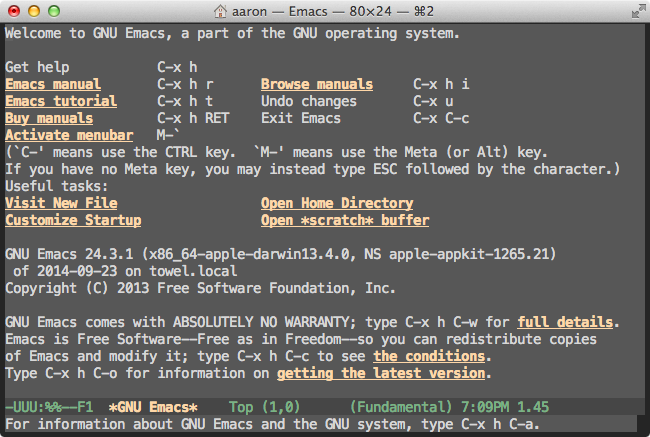
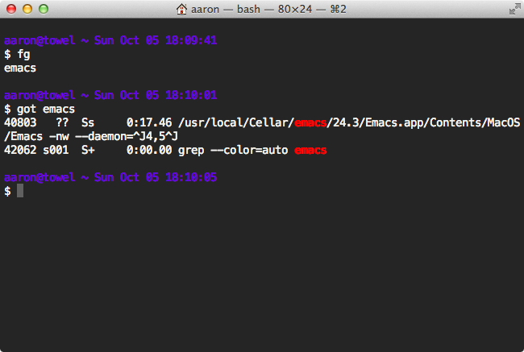
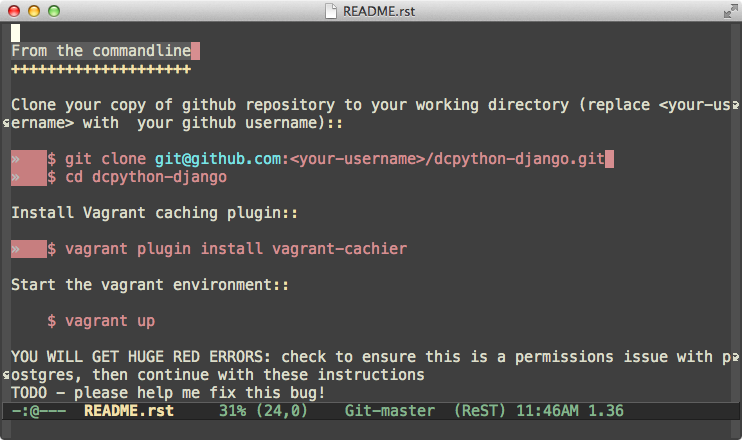

# Emacs and Python

I've been having a pretty good time with [Emacs][], and I'd like to
tell you about it. Python is one of the things that Emacs is good for,
and I'll get to that. But I'm going to try to do a pretty broad survey
of why Emacs makes me happy.

[Emacs]: http://www.gnu.org/software/emacs/

I've been using Emacs for around 20 years, so I'm still a newbie.
That's partially a joke, but it's also true that I've only started to
get into using Emacs well in the past several months. There are
probably several people here who are better with Emacs than me. I look
forward to getting your feedback and advice for improving.

To work on the project, we'll clone my fork of the repo and open up the `README.rst`. It opens up in `reStructuredText` mode.

Before we get to the numbered lists, we notice some whitespace problems: tabs and trailing whitespace.

So we make a branch to do some work on. Then we can `mark-whole-buffer` and `untabify`. Tabs are changed to spaces. Then `delete-trailing-whitespace`. Good.

We can make a quick commit with this change very quickly.

Down at the bottom, it looks like [markdown](http://daringfireball.net/projects/markdown/) in [reStructuredText](http://docutils.sourceforge.net/rst.html). We need to fix the back-ticks and the numbered lists.

In reStructuredText, you need double back-ticks. Select the region, query-replace with `M-%`, enter "`" and "``", and if feeling confident, use "!" to replace all.

Oops, one command isn't back-ticked that should be. Nice chance to show `expand-region` and `wrap-region`. All good - commit.

The numbered lists aren't hard to fix in this case, but let's show some more features. We'll make a macro, starting it with `C-x (`. Then `C-s` for `1` to go to the start of a numbering region. `C-a` for the start of the line. Set mark with `C-<space>`. Do a regular expression search for a blank line ("^$") with `M-C-s`. Previous line with `C-p`. Number the lines with a rectangle command, `C-x r N`. Next line to clear the numbering, and finish the macro with `C-x )`. Then we can run it again with `C-x e`, and again with just `e`.

This isn't really done, so let's go back to the first "1." and select it, then invoke a `multiple-cursors` command to select them all and clean up. Presto!

Commit, push, pull request, new branch (from master) for a `first_test`.

All my configuration is in my [.emacs.d](https://github.com/ajschumacher/.emacs.d).

Thanks:

 * [Rami Chowdhurry](https://twitter.com/necaris) (recommended org-reveal)
 * [Jenna Colazzi](https://twitter.com/jayaresee87) (recommended M-g M-g, flycheck)
 * [Harry Schwartz](http://harryrschwartz.com/) and Eric and all the speakers at the [New York Emacs Meetup](http://emacsnyc.org/)
 * [Sacha Chua](https://twitter.com/sachac) ([blog](http://sachachua.com/), [Emacs Chat](http://sachachua.com/blog/category/podcast/emacs-chat-podcast/))
 * [Magnar Sveen](https://twitter.com/magnars) ([emacs rocks](http://emacsrocks.com/), [what the .emacs.d!?](http://whattheemacsd.com/))
 * [Bozhidar Batsov](https://twitter.com/bbatsov) ([Prelude](https://github.com/bbatsov/prelude), [Emacs Redux](http://emacsredux.com/))
