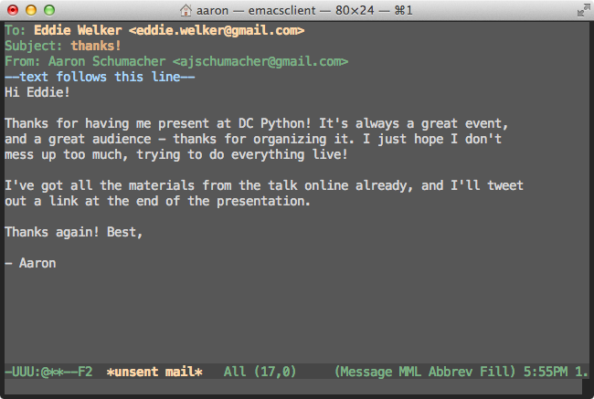
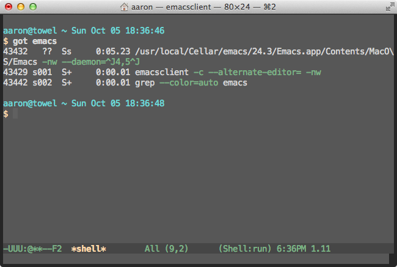
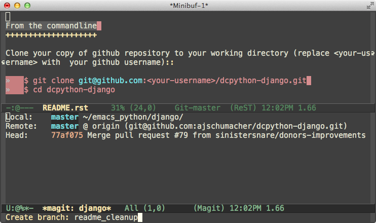
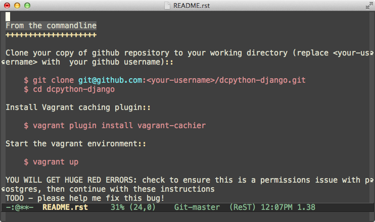
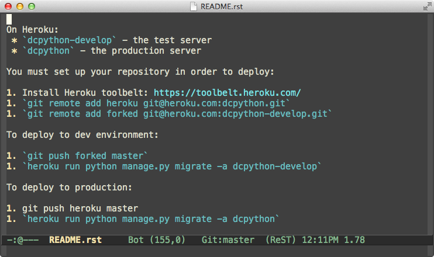

# Emacs and Python

A short talk for the [DC Python meetup group][] on [October 7, 2014][].

[DC Python meetup group]: http://www.meetup.com/DCPython/
[October 7, 2014]: http://www.meetup.com/DCPython/events/208969552/

Python is one of the things that [Emacs][] is good for, and I'll get
to that.

This is a screen you see when you start up Emacs. There's a tutorial,
a manual... There's a lot there by default, and it's all very
user-friendly.

[Emacs]: http://www.gnu.org/software/emacs/

    M-x tetris

Tetris is included in base Emacs, for example. But Emacs is also a
text editor. Editing text is important.

So why Emacs?

    C-x C-c

In addition to editing text, you probably need or want to send
computers commands via text. It may be convenient or necessary in some
cases to be productive in a pure text environment. So it is a
desirable characteristic of a text editor that it be as capable in
text mode as graphical mode. There are only two serious contenders:
[Vim][] and Emacs.

[Vim]: http://www.vim.org/

There are further reasons to prefer a keyboard-based interface, but at
a minimum we need an editor that can be used over [ssh][].

[ssh]: http://en.wikipedia.org/wiki/Secure_Shell

    got bash
    alias got
    grep -o '\w*grep' ~/.bashrc | sort | uniq -c

I use [bash][], and I have it customized a little bit, which makes it
more useful. I'll come back to this.

[bash]: http://www.gnu.org/software/bash/

If you're competent in a shell like `bash`, you likely know some
keyboard shortcuts. Defaults like <kbd>Ctrl</kbd> + <kbd>a</kbd>
(`C-a`) to go to the beginning of a line are very useful. These are
Emacs keybindings. They're the [readline][] defaults. They're
ubiquitous.

[readline]: http://cnswww.cns.cwru.edu/php/chet/readline/rltop.html

Keyboard shortcuts that work in `bash`, Emacs, and many other places:

 * `C-a`: go to beginning of line
 * `C-e`: go to end of line
 * `C-b`: go back one character
 * `M-b`: go back one word
 * `C-f`: go forward one character
 * `M-f`: go forward one word
 * `C-p`: previous
 * `C-n`: next
 * `C-r`: reverse search
 * `C-l`: clear screen
 * `C-k`: kill to end of line (cut)
 * `C-y`: yank (paste)
 * `C-t`: transpose character

Emacs does require effort to learn, but you already know a lot of its
keybindings, or should, and they can be used in many places.

    fg

If you want, the many places you use Emacs can be all inside Emacs.
Here I'm just finishing an email.

Probably the biggest attraction of Emacs is its customizability. Part
of that is in selecting which parts you use.

    C-c C-c
    C-x C-c
    got emacs

Emacs can run client-server. I use this way of running Emacs to get a
lot of the same benefits that you get with [screen][] or [tmux][]. I
don't lose anything if a network connection dies, and it's also just
faster to start up the Emacs client.

[screen]: http://www.gnu.org/software/screen/
[tmux]: http://tmux.sourceforge.net/

    e
    M-x shell
    got emacs
    eg &

Base Emacs includes a lot, and you can manage in base Emacs. you
probably won't want to use stock Emacs. It's best to think of Emacs
more as a kit for making an editor.

I've been using Emacs for around 20 years, so I'm still a newbie.
That's partially a joke, but it's also true that I've only started to
get into using Emacs well in the past several months. There are
probably several people here who are better with Emacs than me. I look
forward to getting your feedback and advice for improving.

To work on the project, we'll clone my fork of the repo and open up the `README.rst`. It opens up in `reStructuredText` mode.

Before we get to the numbered lists, we notice some whitespace problems: tabs and trailing whitespace.

So we make a branch to do some work on. Then we can `mark-whole-buffer` and `untabify`. Tabs are changed to spaces. Then `delete-trailing-whitespace`. Good.

We can make a quick commit with this change very quickly.

Down at the bottom, it looks like [markdown](http://daringfireball.net/projects/markdown/) in [reStructuredText](http://docutils.sourceforge.net/rst.html). We need to fix the back-ticks and the numbered lists.

In reStructuredText, you need double back-ticks. Select the region, query-replace with `M-%`, enter "\`" and "\`\`", and if feeling confident, use "!" to replace all.

Oops, one command isn't back-ticked that should be. Nice chance to show `expand-region` and `wrap-region`. All good - commit.

The numbered lists aren't hard to fix in this case, but let's show some more features. We'll make a macro, starting it with `C-x (`. Then `C-s` for `1` to go to the start of a numbering region. `C-a` for the start of the line. Set mark with `C-<space>`. Do a regular expression search for a blank line ("^$") with `M-C-s`. Previous line with `C-p`. Number the lines with a rectangle command, `C-x r N`. Next line to clear the numbering, and finish the macro with `C-x )`. Then we can run it again with `C-x e`, and again with just `e`.

This isn't really done, so let's go back to the first "1." and select it, then invoke a `multiple-cursors` command to select them all and clean up. Presto!

Commit, push, pull request, new branch (from master) for a `first_test`.

All my configuration is in my [.emacs.d](https://github.com/ajschumacher/.emacs.d).

Thanks:

 * [Rami Chowdhurry](https://twitter.com/necaris) (recommended org-reveal)
 * [Jenna Colazzi](https://twitter.com/jayaresee87) (recommended M-g M-g, flycheck)
 * [Harry Schwartz](http://harryrschwartz.com/) and Eric and all the speakers at the [New York Emacs Meetup](http://emacsnyc.org/)
 * [Sacha Chua](https://twitter.com/sachac) ([blog](http://sachachua.com/), [Emacs Chat](http://sachachua.com/blog/category/podcast/emacs-chat-podcast/))
 * [Magnar Sveen](https://twitter.com/magnars) ([emacs rocks](http://emacsrocks.com/), [what the .emacs.d!?](http://whattheemacsd.com/))
 * [Bozhidar Batsov](https://twitter.com/bbatsov) ([Prelude](https://github.com/bbatsov/prelude), [Emacs Redux](http://emacsredux.com/))
